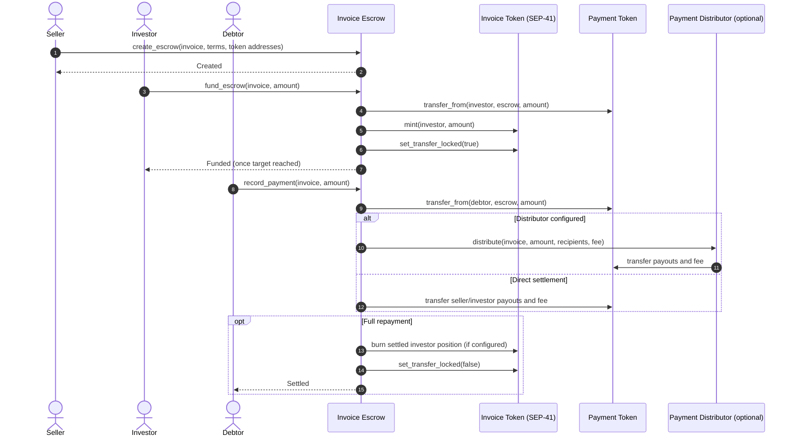
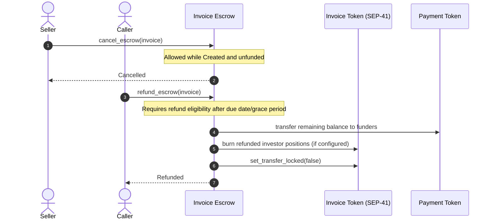
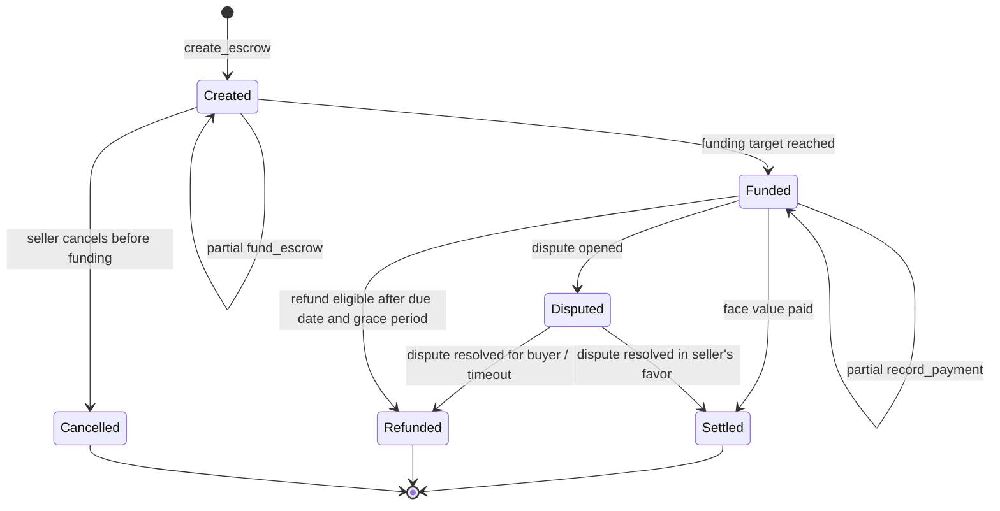

# StellarSettle Architecture Overview

This document describes the multi-contract architecture powering the StellarSettle decentralized invoice financing platform on Stellar Soroban.

---

## System Diagram

```
┌─────────────────────────────────────────────────────────────────────┐
│                        CLIENT APPLICATION                          │
│              (JavaScript/TypeScript — @stellar/stellar-sdk)        │
└──────────┬──────────────────┬──────────────────┬────────────────────┘
           │                  │                  │
           ▼                  ▼                  ▼
┌──────────────────┐ ┌──────────────────┐ ┌──────────────────────────┐
│  Invoice Escrow  │ │  Invoice Token   │ │  Payment Distributor     │
│  Contract        │ │  Contract        │ │  Contract                │
│                  │ │  (SEP-41)        │ │                          │
│  • create_escrow │ │  • mint          │ │  • distribute            │
│  • fund_escrow   │ │  • transfer      │ │  • set_fee_bps           │
│  • record_payment│ │  • approve       │ │                          │
│  • cancel_escrow │ │  • burn          │ │  Handles pro-rata        │
│  • refund        │ │  • balance       │ │  investor payouts and    │
│  • set_paused    │ │                  │ │  platform fee deduction  │
│  • upgrade       │ │  Transfer locks  │ │                          │
│                  │ │  during active   │ │                          │
│  Manages escrow  │ │  escrow period   │ │                          │
│  lifecycle and   │ │                  │ │                          │
│  state machine   │ │                  │ │                          │
└────────┬─────────┘ └────────┬─────────┘ └────────┬─────────────────┘
         │                    │                     │
         └────────────────────┼─────────────────────┘
                              │
                              ▼
                 ┌────────────────────────┐
                 │   Stellar Soroban      │
                 │   Runtime (Testnet /   │
                 │   Mainnet)             │
                 │                        │
                 │   • Instance Storage   │
                 │   • Persistent Storage │
                 │   • Temporary Storage  │
                 │   • TTL Extensions     │
                 └────────────────────────┘
```

---

## Contract Responsibilities

### 1. Invoice Escrow (`invoice-escrow`)
- **Purpose:** Core state machine managing the full escrow lifecycle.
- **Storage:** Instance storage for config/admin; persistent storage for escrow data keyed by invoice Symbol.
- **Source:** [`contracts/invoice-escrow/src/lib.rs`](../contracts/invoice-escrow/src/lib.rs)

### 2. Invoice Token (`invoice-token`)
- **Purpose:** SEP-41 compliant fungible token representing tokenized invoice ownership shares.
- **Storage:** Instance storage for metadata and total supply; persistent storage for balances and allowances.
- **Source:** [`contracts/invoice-token/src/lib.rs`](../contracts/invoice-token/src/lib.rs)

### 3. Payment Distributor (`payment-distributor`)
- **Purpose:** Fan-out engine that distributes settlement payments to seller, investors (pro-rata), and platform fee recipient.
- **Storage:** Instance storage for fee configuration.
- **Source:** [`contracts/payment-distributor/src/lib.rs`](../contracts/payment-distributor/src/lib.rs)

---

## Data Flow: Happy-Path Settlement

1. **Seller** calls `create_escrow` → Escrow enters `Created` state.
2. **Investor** calls `fund_escrow` → Payment tokens transferred to escrow; invoice tokens minted to investor. Escrow enters `Funded` state.
3. **Debtor** calls `record_payment` → Payment pulled into escrow; `distribute` invoked on Payment Distributor for pro-rata payouts. Escrow enters `Settled` when fully paid.
4. Invoice tokens unlocked for free transfer after settlement.

---

## References

- State transitions: [`docs/state-machine.md`](state-machine.md)
- Error codes: [`docs/error_catalog.md`](error_catalog.md)
- Gas benchmarks: [`docs/benchmarks.md`](benchmarks.md)
- Threat model: [`docs/threat_model.md`](threat_model.md)

## Contract Interaction Sequences

The diagrams below describe the current escrow calls, including the separate invoice-token and payment-token effects. `Payment Distributor` is optional; without it, escrow performs the payout transfers itself.

### Funding and full settlement



### Refund and cancellation



## Lifecycle State Transitions



`Created` covers both zero funding and partial funding; `Funded` is entered when the purchase target is reached. Partial repayments keep the escrow `Funded`. Terminal statuses cannot be funded or settled again. See [state-machine.md](state-machine.md) for the transition and invariant table.
